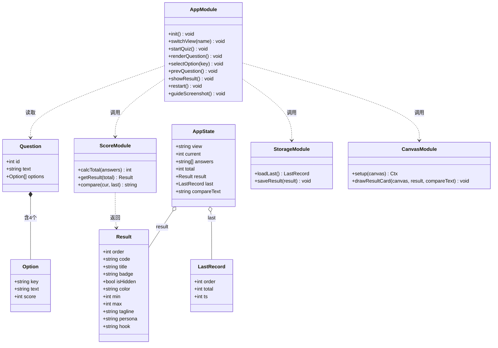
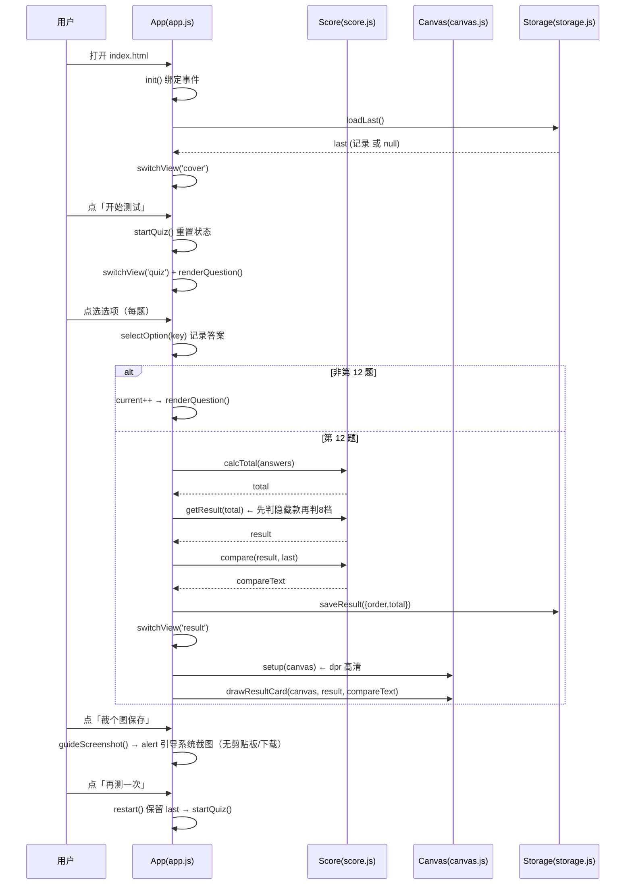
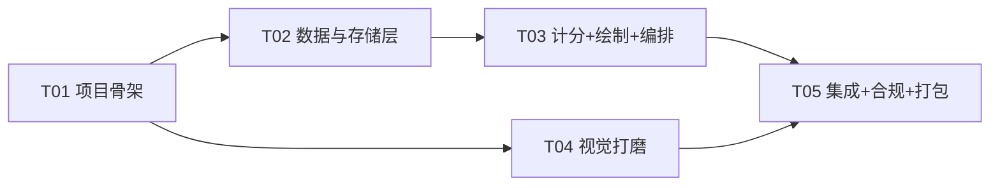

# 「下班自由等级测试」小红书小工具 · 系统架构设计 + 任务分解

> 架构师：高见远（Bob）｜版本：v1.0｜对应 PRD：v1.3
> 账号：Evan下班了 ｜ 产物形态：小红书小工具 zip 包（index.html 唯一入口 + 自包含资源）

---

## 1. 实现方案 + 框架选型

### 1.1 核心结论：原生 HTML/CSS/JS 单页，零框架、零依赖

| 维度 | 决策 | 理由（呼应平台约束） |
|------|------|----------------------|
| 技术栈 | 原生 HTML + CSS + JS 单页应用 | 平台强制「纯 Web 应用、运行在受限沙箱」，禁止 npm 依赖 / CDN / 网络请求，Vite/React/MUI/Tailwind 一律不可用 |
| 页面结构 | 单个 `index.html`，内含三个 `<section>` 视图（封面 / 答题 / 结果） | 平台「.html 是唯一入口」，多视图用单页内切换，避免多页面加载 |
| 脚本组织 | 7 个外置 `.js`，用 `<script src="./js/xxx.js">` 按顺序引入 | 平台「禁止内联 `<script>` 与行内事件」，脚本必须外置 |
| 事件绑定 | 一律 `addEventListener`，DOM 上不出现 `onclick="..."` | 平台硬性要求 |
| 状态管理 | 不引入框架；用一个全局状态对象 `state` + `switchView()` 切换视图 | 应用状态极简单（一个答题状态 + 一个结果），框架反而增加体积与复杂度 |
| 样式 | 内联 `<style>` + 外链 `css/style.css`；样式内联/内联 style 均允许 | 平台明确允许；外链 css 便于维护 |
| 结果卡 | Canvas 2D（`getContext('2d')`）绘制 | 平台唯一完整支持的图形能力；且 Canvas 内文字不可选中，符合「截图晒、不需复制」的意图 |
| 本地存储 | `localStorage`（按小工具隔离） | 平台允许，用于「再测对比上次等级」 |
| 字体 | 系统字体（`system-ui` / `PingFang SC` / `sans-serif`），不内嵌 | 中文 woff2 体积巨大（数 MB），内嵌会显著增大包体积；系统字体在 iOS/Android 均清晰可用 |

### 1.2 全局命名与模块加载顺序

所有 `.js` 通过 `<script src>` 共享同一个全局作用域。为防污染，采用「一个全局命名空间 + 子模块挂载」的轻量模式（不用模块打包器）：

```
window.CONFIG    ← config.js   常量（分值/颜色/等级区间/存储key）
window.QUESTIONS ← questions.js 12 道题数据
window.RESULTS   ← results.js   10 档结果映射（8 档 + 2 隐藏款）
window.Storage   ← storage.js   localStorage 封装
window.Score     ← score.js     计分 + 判定 + 对比
window.Canvas    ← canvas.js    Canvas 结果卡绘制
window.App       ← app.js       入口 + 事件绑定 + 视图切换 + 流程编排
```

`index.html` 中 `<script src>` 的引入顺序必须固定为：`config → questions → results → storage → score → canvas → app`（app.js 最后，`DOMContentLoaded` 时调用 `App.init()`）。

### 1.3 视图切换方式

三个 `<section id="view-cover|view-quiz|view-result">`，通过 `state.view` 控制：给当前视图加 `.active`（`display:block`），其余 `display:none`。无路由、无 hash，纯 class 切换。

---

## 2. 文件列表及相对路径（zip 内产物）

```
下班自由等级测试/
├── index.html                 # 唯一入口：三视图骨架 + 外链 css/js（严格无内联 script / 无行内事件）
├── css/
│   └── style.css              # 全局样式：牛皮纸主题、卡片、按钮、进度条、安全区、≥44px 热区
├── js/
│   ├── config.js              # 全局常量：分值 S/A/B/C、10 档主色、等级区间、storage key、Canvas 默认尺寸
│   ├── questions.js           # 12 道题硬编码数据（题干 + 4 选项 + 每题分值映射，选项位置已打散）
│   ├── results.js             # 10 档结果映射硬编码（8 档 + 2 隐藏款：称号/主色/区间/梗句/人设/钩子）
│   ├── storage.js             # localStorage 封装：loadLast() 读上次 / saveResult() 写本次
│   ├── score.js               # 计分 calcTotal + 判定 getResult（先隐藏款后 8 档）+ 对比 compare
│   ├── canvas.js              # Canvas 结果卡绘制：dpr 高清 + 按屏宽自适应 + 徽标/称号/文案排版
│   └── app.js                 # 主入口：init + 事件绑定 + switchView + 答题流转 + 结算编排
└── assets/
    ├── evan.png               # Evan IP 头像/人物素材（占位，待 Evan 提供，需压缩后放入）
    ├── robot.png              # 小机器人素材（占位，待 Evan 提供）
    └── paper-texture.png      # 牛皮纸/剪贴板纹理（可选，占位；也可用 CSS 纯色 + 阴影模拟）
```

> 说明：`.md` 不在平台「支持的文件类型」内，因此打包进 zip 的只有上述 `html/css/js/png` 等文件；本文档及 mermaid 图仅存于工程仓库 `docs/`，不进 zip。

---

## 3. 数据结构与接口

### 3.1 数据结构定义（JSON / 伪代码）

**① 选项 Option**
```json
{ "key": "A", "text": "到点？我的下班时间是\"手上这活干完\"", "score": 1 }
```
- `key`：选项字母 A/B/C/D；`text`：选项文案；`score`：分值（S=4 / A=3 / B=2 / C=1，已按位置打散）。

**② 题目 Question**
```json
{
  "id": 1,
  "text": "下班时间一到，你的第一反应是？",
  "options": [ /* 4 个 Option，key 固定 A/B/C/D */ ]
}
```

**③ 结果 Result（10 档，按 order 升序存于数组）**
```json
{
  "order": 8,              // 档位序号 0–9（哦不人=0 → Lv1=1 … Lv8=8 → 神=9）
  "code": "L8",            // 档位代码：L1..L8 / HIDDEN_TOP / HIDDEN_LOW
  "title": "下班拿捏者",   // 有梗称号
  "badge": "👑",           // 徽标 emoji（隐藏款用 👑/💀，普通档可 null 由 Canvas 画 Lv 数字）
  "isHidden": false,       // 是否隐藏款
  "color": "#F5B301",      // 主色 hex（暖→冷渐变）
  "min": 45, "max": 47,    // 分数区间（隐藏款 min==max）
  "tagline": "",           // 梗句（占位，PRD 7.3 定稿）
  "persona": "",           // 人设文案（占位）
  "hook": ""               // 钩子文案（占位）
}
```

**④ 上次记录 LastRecord（localStorage）**
```json
{ "order": 5, "total": 31, "ts": 1730000000000 }
```

**⑤ 应用状态 AppState（内存态，位于 app.js）**
```json
{
  "view": "cover",        // "cover" | "quiz" | "result"
  "current": 0,           // 当前题索引 0–11
  "answers": [],          // 每题选中 key，如 ["B","A",...]；长度 = 已答数
  "total": 0,             // 当前累计总分（实时累加，也可由 answers 重算）
  "result": null,         // 命中的 Result 对象
  "last": null,           // 上次 LastRecord 或 null
  "compareText": ""       // 上次对比提示文案（首次为 ""）
}
```

### 3.2 主要函数签名

| 模块 | 函数 | 说明 |
|------|------|------|
| App | `App.init()` | DOMContentLoaded 后：绑事件 + 读 last + `switchView('cover')` |
| App | `App.switchView(name)` | 切换三视图显隐 |
| App | `App.startQuiz()` | 重置 state（current/answers/total/result）+ 进答题页 + `renderQuestion()` |
| App | `App.renderQuestion()` | 渲染当前题（进度条 + 题干 + 4 选项），绑定选项事件 |
| App | `App.selectOption(key)` | 记录答案；非末题 current++ 进下一题；末题 `showResult()` |
| App | `App.prevQuestion()` | 回上一题（回改，可选功能） |
| App | `App.showResult()` | 结算：计分→判定→对比→`Storage.saveResult()`→进结果页→`Canvas.drawResultCard()` |
| App | `App.restart()` | 「再测一次」：保留 last 引用 → `startQuiz()` |
| App | `App.guideScreenshot()` | 「截个图保存」→ `alert()` 引导系统截图（禁用剪贴板/下载） |
| Score | `Score.calcTotal(answers)` → number | 累加 answers 对应 score |
| Score | `Score.getResult(total)` → Result | 先判隐藏款（48/12），再按 8 档区间匹配 |
| Score | `Score.compare(cur, last)` → string | 生成「↑N档 / ↓N档 / 持平 / 首次」文案 |
| Storage | `Storage.loadLast()` → LastRecord\|null | 读并反序列化 localStorage |
| Storage | `Storage.saveResult(result)` → void | 写 `{order,total,ts}` 到 localStorage |
| Canvas | `Canvas.setup(canvas)` → {ctx,w,h} | 按屏宽算逻辑尺寸 × dpr 高清设置 |
| Canvas | `Canvas.drawResultCard(canvas, result, compareText)` → void | 自上而下绘制徽标/称号/梗句/人设/钩子/底部导流 |

### 3.3 数据结构关系图（classDiagram）



---

## 4. 程序调用流程

### 4.1 完整流程（sequenceDiagram）



### 4.2 关键时机标注

| 时机 | 动作 | 读写 |
|------|------|------|
| 页面加载 | `App.init()` | **读** localStorage（loadLast，用于封面/结果页对比） |
| 每题点击 | `selectOption` → `renderQuestion` | 内存态 `state.answers` 追加 |
| 第 12 题提交 | `showResult()` 内先计分判定、后 `saveResult` | **写** localStorage（本次等级序号 + 总分） |
| 进入结果页 | `Canvas.setup` + `drawResultCard` | Canvas 绘制（文字不可选中，有意设计） |
| 再测一次 | `restart()` | 仅重置内存态；`last` 引用保留，不重复写 localStorage |

---

## 5. 任务列表（按实现顺序，含依赖）

> 粒度原则：按「功能层次/文件组」分组，共 5 个任务（硬上限内）；每个任务 ≥3 文件；第一任务是项目基础设施；尽量并行、减少长依赖链。

### T01 项目骨架与全局基础设施（P0）
- **负责文件（新建）**：`index.html`、`css/style.css`、`js/config.js`、`assets/evan.png`（占位）、`assets/robot.png`（占位）、`assets/paper-texture.png`（占位）
- **依赖**：无
- **验收要点**：
  1. `index.html` 是唯一入口，含三个 `<section>` 视图骨架（封面/答题/结果）+ 按固定顺序外链 7 个 `.js` + `css/style.css`；**全文件无内联 `<script>`、无 `onclick=` 等行内事件**。
  2. `css/style.css` 落地牛皮纸底 `#F2E4C8`、Evan 黄 `#FFC327` 主色；所有可点击元素热区 ≥44px；`viewport` + `env(safe-area-inset-*)` 覆盖刘海/Home 条；375–430px 竖屏适配。
  3. `js/config.js` 定义全部分值常量（S=4/A=3/B=2/C=1）、10 档主色、`STORAGE_KEY`、Canvas 默认逻辑宽/高、10 档 order 序号映射。

### T02 数据与存储层（P0）
- **负责文件（新建）**：`js/questions.js`、`js/results.js`、`js/storage.js`
- **依赖**：T01（需 `config.js` 常量）
- **验收要点**：
  1. `questions.js` 含完整 12 题，每题 4 选项，分值映射与 PRD 逐一一致（选项位置已打散）；提供一个「12 题分值对照表」供自查。
  2. `results.js` 含完整 10 档（8 档 + 2 隐藏款），字段齐全（order/code/title/badge/isHidden/color/min/max/tagline/persona/hook），区间 12–48 连续不重不漏；梗句/人设/钩子先占位。
  3. `storage.js` 用 `try/catch` 包裹 `JSON.parse`/`setItem`（防止沙箱禁用存储时崩溃），暴露 `loadLast()` / `saveResult()`。

### T03 计分判定 + 结果卡绘制 + 流程编排（P0）
- **负责文件（新建）**：`js/score.js`、`js/canvas.js`、`js/app.js`
- **依赖**：T02（需 questions/results/storage 数据与接口）
- **验收要点**：
  1. `score.js` 判定顺序严格「先隐藏款（48 神 / 12 哦不人）→ 再 8 档区间」；`compare()` 按 order 差值输出 ↑/↓N档/持平/首次。
  2. `canvas.js` 用 `getContext('2d')`，`setup()` 按屏宽算逻辑宽 × `devicePixelRatio` 高清，覆盖 320px 至全面屏；`drawResultCard()` 自上而下绘徽标→称号→梗句→人设→钩子→底部「主页还有《用AI准时下班》」，Canvas 内文字不可选中。
  3. `app.js` 全部事件用 `addEventListener` 绑定，完整打通「封面→答题→结果→再测」流转；结算时正确调用 saveResult + drawResultCard。

### T04 视觉打磨与响应式适配（P1）
- **负责文件（修改）**：`css/style.css`、`js/canvas.js`、`index.html`、`assets/*`（替换占位素材）
- **依赖**：T01（可与 T03 并行，仅改样式/素材，不碰逻辑）
- **验收要点**：
  1. 落地「复古牛皮纸剪贴板拼贴风」：牛皮纸底 + 剪贴板/胶带/阴影细节 + Evan IP（黄T恤/圆框眼镜/黑短发）+ 小机器人。
  2. 等级徽标暖→冷渐变色系严格对齐 10 档主色；结果卡排版在 320px / 375px / 430px 下均不溢出、不裁字。
  3. 图片素材压缩后放入（单张建议 ≤150KB，避免包体积过大）；字体统一系统字体。

### T05 集成联调 + 禁用 API 合规审查 + 打包（P0）
- **负责文件（修改）**：`index.html`、`js/app.js`、`js/config.js`（联调收口）；合规自查脚本/清单可放工程仓库 `docs/`（不进 zip）
- **依赖**：T03、T04
- **验收要点**：
  1. 全流程真机/模拟器走通：封面→12 题→结果卡（含 2 隐藏款分支）→再测对比（↑/↓/持平）→再测重置。
  2. **全量 grep 自查禁用 API**：确保代码不含 `fetch/XMLHttpRequest/eval/new Function/WebAssembly/Worker/Service Worker/iframe/window.open/prompt/navigator.clipboard/execCommand('copy')/a[download]/blob/navigator.geolocation/requestFullscreen` 及任何行内 `<script>`/`onclick=`。
  3. 打包 zip：`index.html` 位于根、资源自包含、无外部引用；在沙箱内纯本地可运行。

---

## 6. 依赖包列表

**无外部依赖。**

- 不用任何 npm 包、CDN、运行时框架（React/Vue/MUI/Tailwind 等一律禁止）。
- 仅使用：**系统字体**（`system-ui` / `PingFang SC` / `sans-serif`）+ **自包含静态资源**（`assets/*.png`）。
- 若后续确需自定义字体，仅允许内嵌 `.woff2`；但中文字体文件体积大（常 2–5MB），会显著增大 zip，**默认不内嵌，建议系统字体**。

---

## 7. 共享知识（跨文件约定）

1. **分值常量**（config.js 唯一出处，其余文件引用不重定义）：`S=4 / A=3 / B=2 / C=1`。
2. **总分区间**：12–48；`MIN_TOTAL=12`、`MAX_TOTAL=48`。
3. **判定顺序（硬性）**：先判隐藏款 → 满分 48 =「下班自由的神」（order 9，#FFC300）；最低 12 =「哦不人·天花板」（order 0，#47505C）；其余 13–47 落入 8 档（Lv8 45–47 → Lv1 13–21，order 8→1）。
4. **档位序号（order）**：哦不人=0 → Lv1=1 → Lv2=2 → Lv3=3 → Lv4=4 → Lv5=5 → Lv6=6 → Lv7=7 → Lv8=8 → 神=9；「再测对比」的 ↑/↓N 档据此相减。
5. **10 档主色常量**（暖→冷）：神 `#FFC300`、Lv8 `#F5B301`、Lv7 `#FFB020`、Lv6 `#FF8C42`、Lv5 `#FF7A5C`、Lv4 `#17B890`、Lv3 `#4FA8A0`、Lv2 `#5B7F9E`、Lv1 `#6B7A8F`、哦不人 `#47505C`；页面底 `#F2E4C8`、Evan 黄 `#FFC327`。
6. **storage key**：`xfzy_last_result`（存 JSON `{order,total,ts}`）。
7. **脚本加载顺序**（index.html 固定）：config → questions → results → storage → score → canvas → app；app.js 在 `DOMContentLoaded` 调 `App.init()`。
8. **事件绑定规范**：一律 `element.addEventListener('click', handler)`；禁止 `onclick=`、内联 `<script>`；选项按钮用 `data-key` 属性传递选项字母。
9. **Canvas 绘制规范**：`setup(canvas)` 统一做 `canvas.width = 逻辑宽 * dpr; canvas.height = 逻辑高 * dpr; ctx.scale(dpr,dpr)`，CSS 用逻辑尺寸展示；绘制文字一律显式指定 `fillStyle`/`font`，不依赖继承；Canvas 内文字**有意不可选中**。
10. **命名约定**：全局命名空间 `CONFIG/QUESTIONS/RESULTS/Storage/Score/Canvas/App`；DOM id 用 `view-cover/view-quiz/view-result`、`btn-*`、`opt-*`、`result-canvas`。
11. **隐私红线**：无输入框（纯点击）、零数据采集、零网络请求；结果仅存本机 localStorage，不上传。
12. **禁用清单**（代码内严禁出现）：见 §5 T05 验收要点 2 的完整清单。

---

## 8. 待明确事项

> 以下需 Evan / 团队后续确认，均为非阻塞项（当前可先用占位/默认值实现）。

1. **【版本冲突，需优先确认】** 工程 `handoff/下班自由等级测试-修正终版.md` 描述的是「8 道题 / 4 等级（S/A/B/C）」版本，而本次任务 PRD v1.3 是「12 道题 / 8 档 + 2 隐藏款」。本设计**以 PRD v1.3（12 题 / 8+2 档）为准**。请确认 v1.3 为最终口径，避免工程师写错数据。
2. **结果卡精确尺寸**：Canvas 逻辑宽建议跟随屏宽（375 基准），逻辑高建议固定 4:5 或 9:16 比例；具体比例需确认（影响截图观感）。
3. **Evan 头像 / 小机器人素材**：仓库 `assets/character-evan/` 现为 1.5MB+ 的竖版大图，需 Evan 确认选哪张、是否提供切好的小尺寸透明底素材；当前设计用 `assets/evan.png`、`assets/robot.png` 占位。
4. **梗句 / 人设 / 钩子最终文案**（PRD 7.3）：架构阶段用占位符，数据结构已定义 4 字段，需文案定稿后回填 `results.js`。
5. **是否做「回改」（上一题）**：PRD 标注「可选」，本设计预留 `App.prevQuestion()`；请确认是否保留，以及是否做「切题过渡动画」。
6. **「截个图保存」引导文案**：因禁用剪贴板/下载，只能用 `alert()` 引导用户系统截图，具体话术需确认。
7. **结果卡底部/水印**：是否需要落「@Evan下班了」账号水印 + Logo，以及底部导流文案精确措辞（「主页还有《用AI准时下班》」）。
8. **是否内嵌自定义字体**：默认系统字体；如需品牌字体需另行提供 .woff2（注意包体积）。

---

### 附：12 题分值对照表（供工程师自查用）

| 题号 | A | B | C | D |
|------|---|---|---|---|
| 1 | 1 | 4 | 2 | 3 |
| 2 | 3 | 1 | 4 | 2 |
| 3 | 2 | 3 | 1 | 4 |
| 4 | 4 | 2 | 3 | 1 |
| 5 | 2 | 1 | 4 | 3 |
| 6 | 3 | 4 | 2 | 1 |
| 7 | 1 | 2 | 3 | 4 |
| 8 | 4 | 3 | 1 | 2 |
| 9 | 2 | 4 | 1 | 3 |
| 10 | 1 | 3 | 4 | 2 |
| 11 | 3 | 1 | 4 | 2 |
| 12 | 2 | 4 | 1 | 3 |

### 附：任务依赖图


